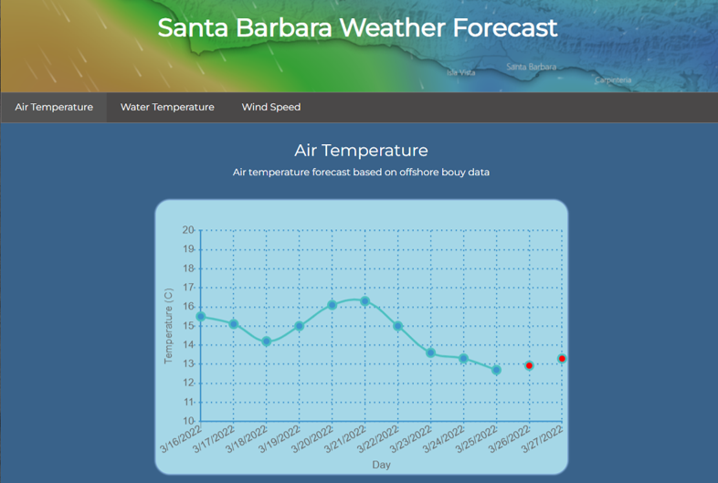

<h3 align="center"> Highlighted Projects </h3>
<table >
<tr>
<th> <a href="https://github.com/dakotarawlings/tool_image_classification">Tool image classifier</a></th>
<th> <a href="https://github.com/dakotarawlings/SantaBarbara_house_price_prediction">Local realestate market analysis</a> </th>
</tr>
<tr>
<td>

  
  
   
  <em> https://tool-image-classifier.herokuapp.com/</em>
   

* Web scrape ~4000 images of 10 different tool classes
* Image augmentation, image rescaling, and image reformatting 
* Built  CNN image recognition model using Tensorflow (accuracy ~95%)
* Flask API endpoint and full stack web application 

</td>
<td>

   
    
   
  <em> https://sb-house-price-prediction.herokuapp.com/</em>
   

* Scraped data from ~1500 trulia.com past listings. Created SQL DB
* Scaling, normalization, one hot encoding, KNN imp., NLP
* Lnear, lasso, random forest, LightGBM, Catboost, and XGboost models
* Flask API endpoint and full stack web application 

</td>
</tr>
  <tr>
<th> <a href="https://github.com/dakotarawlings/cpp_deep_learning_library">Deep learning library in C++ </th>
<th> <a href="https://github.com/dakotarawlings/live_weather_prediction">Live weather prediction </th>
</tr>
<tr>
<td>

  

  
  
   
  <em> https://number-recognition-app.herokuapp.com/ </em>
   

* Wrote a feed forward neural network model-building library from scratch in C++
* Used pibind11 to build a wrapper for the C++ library to create a python DLL 
* Used library to to build and train FFNN model on MNIST DB
* Flask API endpoint and full stack web application 
  

</td>
<td>

  
   
  <em> </em>
   

* Ongoing timeseries project
* Live webscraper for realtime local weather data
* Hybrid model to predict future weather parameters
* live weather prediction webapp

</td>
</tr>
  
</table>

